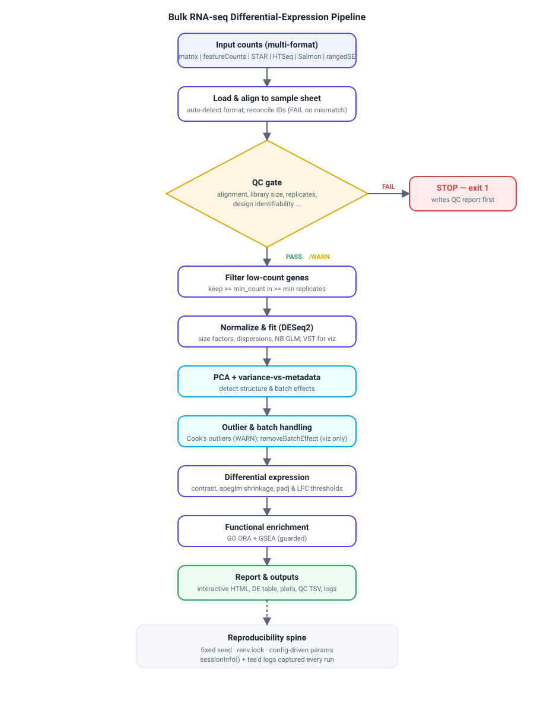

# rnaseq-de-pipeline

A **reproducible, production-grade bulk RNA-seq differential-expression (DE)
pipeline** in R (DESeq2). It takes a raw gene-level count matrix + a sample sheet
through QC → normalization → exploratory analysis (PCA) → outlier & batch
handling → differential expression → functional enrichment, and emits a
self-contained HTML QC/DE report, a DE table, plots, and full logs.

Design priorities, in order: **correctness · reproducibility · transparency ·
robustness to messy inputs · loud, unmissable QC pass/fail.**



## Quickstart

```bash
# 1. Restore the exact pinned dependency set (R >= 4.2, Bioconductor 3.18)
Rscript -e 'renv::restore()'

# 2. Run the built-in airway positive-control self-test end-to-end
Rscript run_pipeline.R --validate --config config/config.example.yaml

# 3. Run on your own data
Rscript run_pipeline.R \
  --counts path/to/counts --metadata sample_sheet.csv \
  --config config/config.yaml --input-format auto --outdir results/
```

Any QC **FAIL** stops the run and returns a non-zero exit code (override with
`--force`, which is logged).

## Documentation

- **[docs/USAGE.md](docs/USAGE.md)** — thorough usage guide: install, every input
  format, every config option, every output file, how to read the QC report,
  reproducibility model, and troubleshooting.
- **[docs/pipeline.svg](docs/pipeline.svg)** — the full pipeline DAG.
- **[examples/airway/](examples/airway/)** — committed positive-control output:
  the actual QC table, DE results, plots, enrichment, run metrics, and HTML
  report from the `airway` validation run.

## Positive control

The built-in `--validate` self-test runs the whole pipeline on the Bioconductor
`airway` dataset and asserts it recovers the known glucocorticoid signature
(CRISPLD2, DUSP1, KLF15 significant and up in treated). The exact output of that
run is committed under [examples/airway/](examples/airway/) — QC panel (10 PASS),
831 significant genes, 481 enriched GO:BP terms.

## Requirements

R ≥ 4.2 with Bioconductor 3.18. Core stack: `DESeq2`, `apeglm`, `limma`,
`tximport`, `clusterProfiler`, `org.Hs.eg.db` / `org.Mm.eg.db`, `ggplot2`,
`pheatmap`, `EnhancedVolcano`. See `renv.lock` (pinned) or `environment.yml`
(conda alternative).

## License

MIT (see LICENSE).
